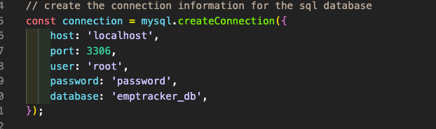

# employee-management-system  

## Description  
A node environment CLI application that allows the user to enter, track and manage employee information for their company/ business. All information entered or updated is stored to a mysql database.    

## Table of Contents  
* [Installation](#installation)  
* [Usage](#usage)  
* [Credits](#credits)   
* [Questions](#questions)  

## Installation  
After cloning this repo, run "npm install" in the directories terminal to install the mysql and inquirer dependencies. This app uses mysql as the database, user's will need to have the mysql workbench on their local device as well. Copy paste the "schema.sql" file into workbench and create the database. User should make sure to add THEIR password into the connection info in app.js. Next, run the command "node app.js" in the terminal to start the inquirer prompts. 

## Usage  
Alongside the mysql database, this app is running with JavaScript. The app.js file is stacked with various functions that query the user's answers into the mysql database accordingly. The user has the option to add company roles, departments, employees and role salaries. Once the user has entered some data they then have the option to view all roles, departments and employee's, as well as update any employee's role. All of the start menu options are built out with a switch case, which ties each function to each option available.   

## Credits  
[mysql query help](https://www.tutorialspoint.com/mysql/mysql-update-query.htm)

## Questions  
Contact information for any questions about this application:
* https://github.com/lucahendicott  
* lucahdavid88@gmail.com  
